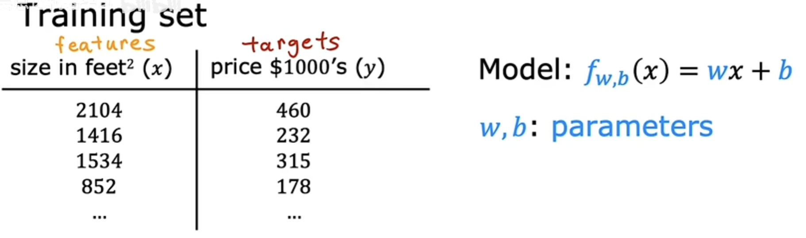
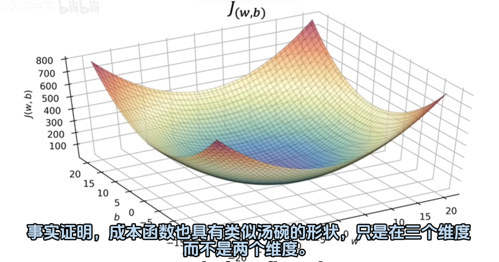
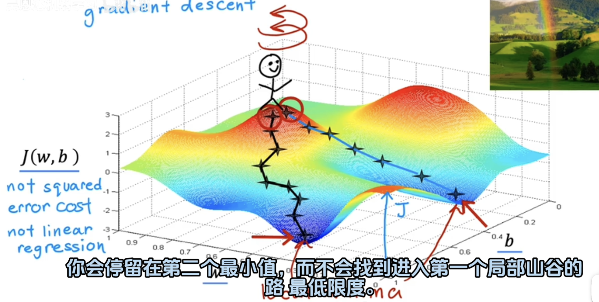
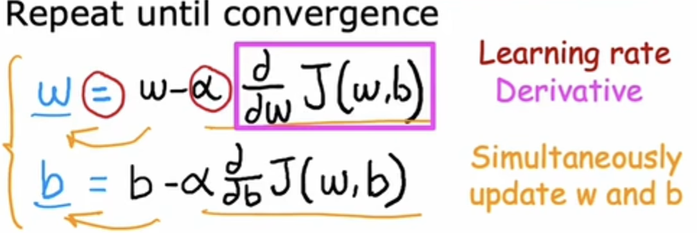
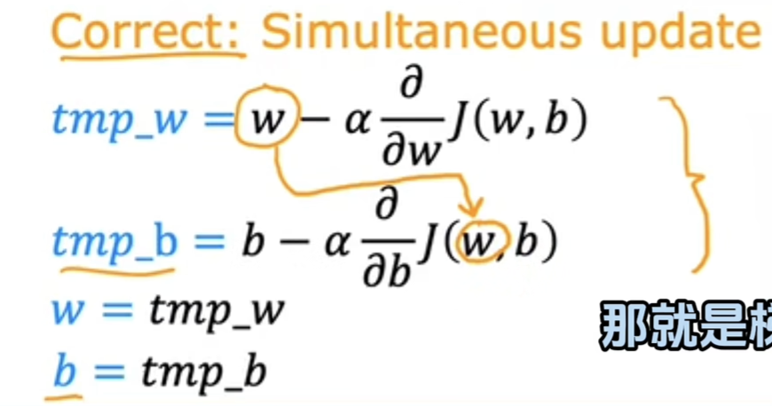
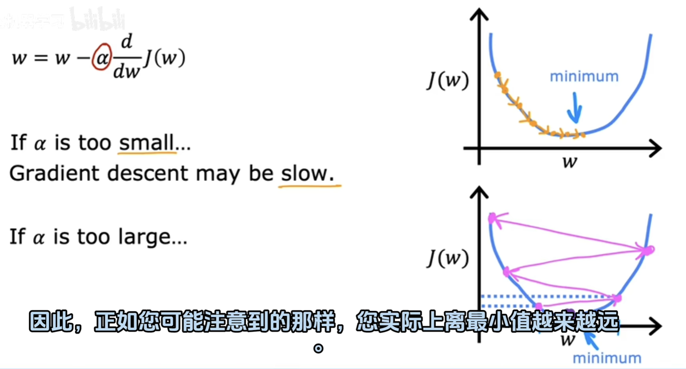
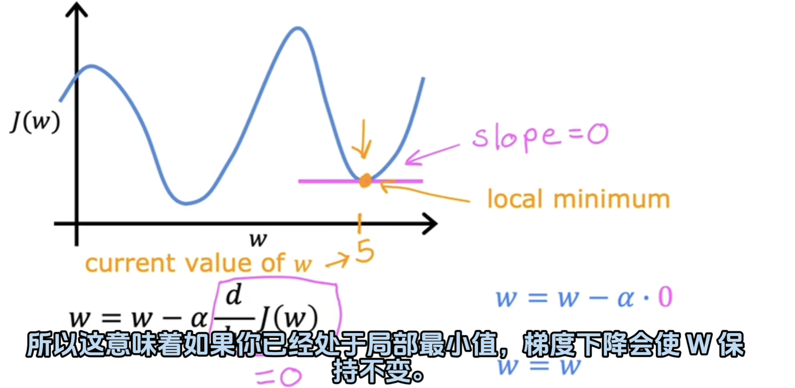
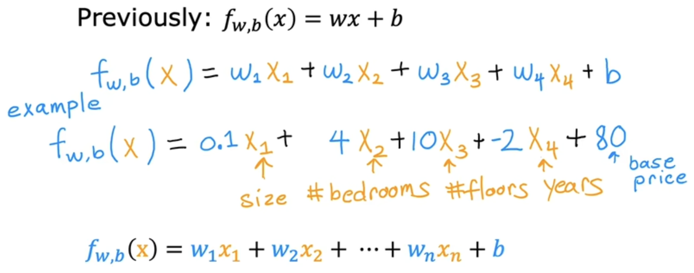
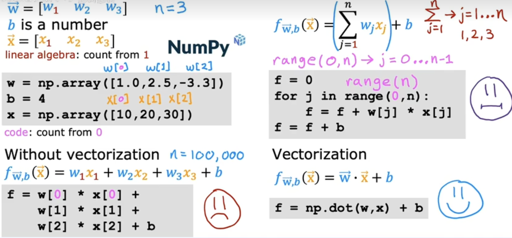

# 机器学习概览

## **Supervised learning 监督学习**

监督学习的关键特征是：你提供学习算法示例以供学习，其中包括正确答案。

通过观察正确的输入x和输出y时，

**学习算法最终学会只接受输入而无需输出标签就能给出合理准确的预测**。

**回归算法**

学会从无限多可能的数字中预测数字

**分类算法**

比如：判断肿瘤是良性的还是恶性的

## Unsupervised learning非监督学习

**Data only comes with inputs x, but not output labels y.**

**Algorithm has to find structure in the data.**

没有给出学习算法"正确答案"。

将未被标记的数据放入不同的集群中。

**clustering 聚类算法** ：group similar data together

**Anamoly detection异常检测：**find unusual data points

**Dimensionality reduction降维：**compress data using fewer numbers

# 线性回归

用来训练模型的叫训练集 training set

x：input variable

y：output variable

## **代价函数**

在机器学习中，模型的参数是你可以在训练期间进行调整以改进该模型的变量。

parameters：w,b

1.代价函数采用预测`y^`值，并通过取`y^-y`将其与目标y进行比较，这种差异称为误差。(预测值和目标值的距离)。

2.接着取这个误差值的平方。

3.最后将数据集的所有误差值的平方累加并求平均数
$$
J(w,b)=\frac{1}{2m}\sum_{i=1}^{m}(\hat{y}^{(i)}-y^{(i)})^2\\
$$
m=number of traning examples

$\hat{y}是预测值$

最终我们需要找到使成本函数变小的w和b的值。
$$
J(w,b)=\frac{1}{2m}\sum_{i=1}^{m}(f_{w,b}(x^{(i)})-y^{(i)})^2\\
$$

线性回归会尝试找到**w和b**的值，然后使`J`变得尽可能小。

我们需要的是一种高效的算法，可以用**代码编写它来自动找到参数w和b的值**，它们会生成最好的拟合线。

事实证明，一种名为**梯度下降**的算法可以做到这一点。

## 梯度下降

你可以随意选择一个起始的点(w,b)，通过梯度下降算法来找到局部最小点。

**问题：当你选择了一个起始点A时，梯度下降算法只能找到局部的最低点，而不是全局最低点。**

**也就是说当你换一个起始点B的时，算法就会找到另一个局部最低点。**

1.首先，我们可以通过梯度下降算法来调整w和b的值。利用以下公式：

重复的执行直到聚合(convergence)。

2.注意，不但要更新w的值，还需要更新b的值，并且是需要同时更新，再进行下次循环。

**正确的做法：**

先算出新的w，再把这个w的值赋给运算b值的函数。

## 学习率

学习率，α的选择将对你实现梯度下降的效率产生巨大的影响。

如果学习率过小，那么则需要非常多次才能够到达最小值。

如果学习率过大，那么则可能离最小值越来越远。

**如果你已经在局部最低点了，那么：**

梯度下降是不会生效的

## 多元线性回归

多数时候，函数不单只有一个x变量，而是多个变量。这时候使用向量来表示所有的x变量。

具有多输入特征的回归函数叫作多元线性回归。

使用点积来表示代价函数：

**multiple linear regression	多元线性回归**

## 向量化

parameters and features

在numpy中，使用非向量化的方式和使用向量化的方式：

