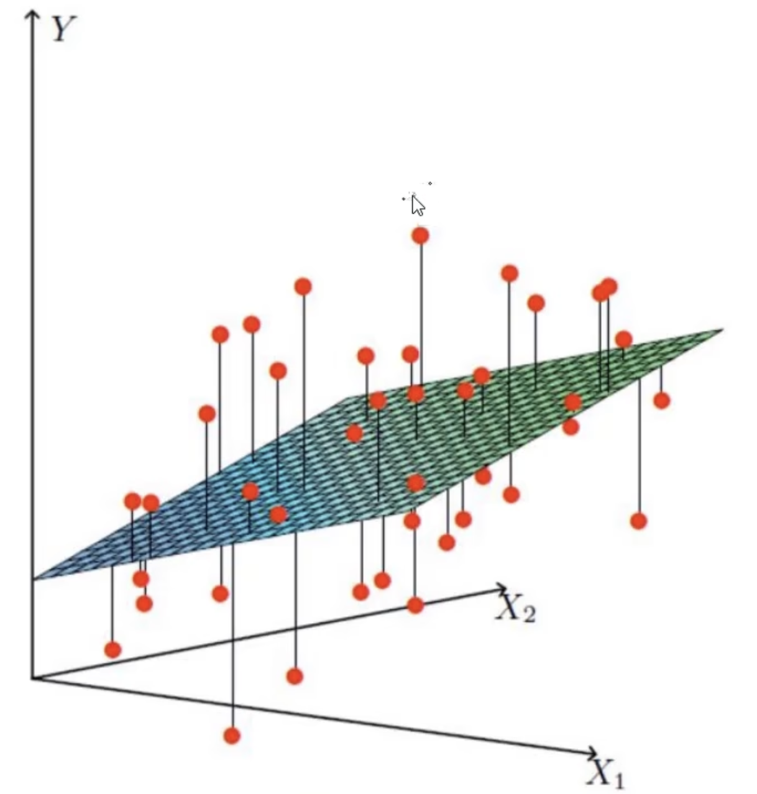

# 线性回归

**例子：**

数据：工资和年龄(2个特征)

目标：预测银行会贷款给我多少钱(标签)

考虑：`工资`和`年龄`都会影响最终贷款额度，那么它们各自有多大的影响呢？(参数)

| 工资(x_1) | 年龄(x_2) | 额度(y) |
| --------- | --------- | ------- |
| 4000      | 25        | 20000   |
| 8000      | 30        | 70000   |
| 5000      | 28        | 35000   |
| 7500      | 33        | 50000   |
| 12000     | 40        | 85000   |

**数学模型：**

$x_1 + x_2 = Y$		很明显不行❎

$x_1θ_1+x_2θ_2 = Y$​	加权重

**通俗解释：**

x1, x2就是特征(年龄，工资)

Y是银行最终会放多少额度的贷款

**找到最合适的一条线来最好地拟合数据点**

**问题：**这个平面无法拟合所有的数据点

**那么：**假设θ1是年龄的参数，θ2是工资的参数

拟合的平面：$h_θ(x)=θ_0+θ_1x_1+θ_2x_2(θ_0是偏置项)$

整合：$h_θ(x)=\sum_{i=0}^{n}θ_ix_i=θ^Tx$

